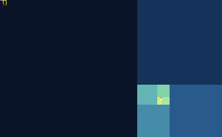
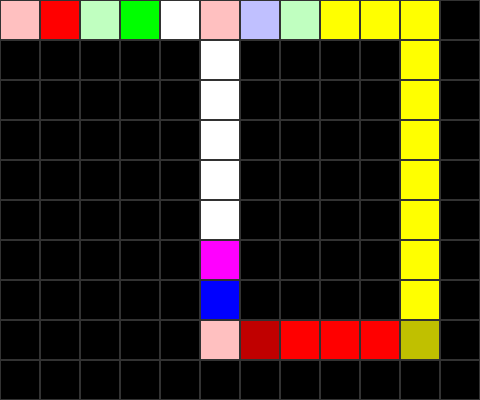

<p align="center">
  
</p>

# Piet-bonacci

Piet is an esoteric language where code is a Mondrian-esque painting ([if you put in enough care](https://kylewoodward.com/current/piet-prime-tester/)). The idea behind this repo was for code to look like the sequence it creates. 

The painting/code ^^ above is a $377 \times 233$ tiling. Every block size is a Fibonacci number, spiraling into a sunset orange center. The actual code is the tiny $12 \times 10$ block in the top-left corner. We will go through the logic pixel-by-pixel below. You can actually create pretty code without this trick, check out the Gallery linked below.


## The Logic 

Below is an upscaled version of the code with a grid overlay to help trace the execution path.



The Piet interpreter moves a pointer through these color blocks. Every time the pointer moves from one color to another, an instruction is executed based on the change in **Hue** and **Lightness**.

### Step-by-Step Execution

| Coordinate | Color | Instruction | Effect |
| :--- | :--- | :--- | :--- |
| **(0,0)** | <font color="#FFC0C0">**Light Red**</font> | — | **Start**. |
| **(0,1)** | <font color="#FF0000">**Red**</font> | <font color="#FF0000">**push**</font> | Pushes **1** (area of previous block). Stack: `[1]` |
| **(0,2)** | <font color="#C0FFC0">**Light Green**</font> | <font color="#C0FFC0">**not**</font> | Pops 1, pushes **0**. Stack: `[0]` |
| **(0,3)** | <font color="#00FF00">**Green**</font> | <font color="#00FF00">**push**</font> | Pushes **1** (area of Light Green block). Stack: `[0, 1]` |
| **(0,4)** | <font color="#FFFFFF">**White**</font> | — | **Cross-over**. Slides the pointer into the loop. |
| **(0,5)** | <font color="#FFC0C0">**Light Red**</font> | — | **Loop Start**. Re-entry point for the recurrence. |
| **(0,6)** | <font color="#C0C0FF">**Light Blue**</font> | <font color="#C0C0FF">**duplicate**</font> | Stack: `[A, B, B]` |
| **(0,7)** | <font color="#C0FFC0">**Light Green**</font> | <font color="#C0FFC0">**duplicate**</font> | Stack: `[A, B, B, B]` |
| **(0,8)** | <font color="#FFFF00">**Yellow**</font> | <font color="#FFFF00">**out (number)**</font> | Pops **B** and prints it. Stack: `[A, B, B]` |
| **(8,10)** | <font color="#C0C000">**Dark Yellow**</font> | <font color="#C0C000">**push**</font> | Pushes **10** (area of large yellow block). Stack: `[A, B, B, 10]` |
| **(8,9)** | <font color="#FF0000">**Red**</font> | <font color="#FF0000">**out (char)**</font> | Pops 10, prints a **Newline**. Stack: `[A, B, B]` |
| **(8,6)** | <font color="#C00000">**Dark Red**</font> | <font color="#C00000">**push**</font> | Pushes **3** (area of red block). Stack: `[A, B, B, 3]` |
| **(8,5)** | <font color="#FFC0C0">**Light Red**</font> | <font color="#FFC0C0">**push**</font> | Pushes **1** (area of dark red block). Stack: `[A, B, B, 3, 1]` |
| **(7,5)** | <font color="#0000FF">**Blue**</font> | <font color="#0000FF">**roll**</font> | Pops 3 and 1, rolls stack depth 3 once. Stack: `[B, A, B]` |
| **(6,5)** | <font color="#FF00FF">**Magenta**</font> | <font color="#FF00FF">**add**</font> | Adds top two. Stack: `[B, A+B]` |
| **(1,5)-(5,5)** | <font color="#FFFFFF">**White**</font> | — | **Return Rail**. Slides the pointer back to `(0,5)`. |


# Regenerating the images

All three images are drawn by [`generate.py`](generate.py) — pure standard library, no dependencies:

```bash
python3 generate.py
```

# Resources: *Ist das Kunst, Mathe oder kann das Weg?*

- [Original Specification](https://www.dangermouse.net/esoteric/piet.html)
- [Piet Sample Gallery](https://www.dangermouse.net/esoteric/piet/samples.html)
- [Esolang Wiki](https://esolangs.org/wiki/Piet)
- [Piet Video Breakdown](https://www.youtube.com/watch?v=IcmCvT5whk0)
- [Good Write Up](https://lutter.cc/piet/)
- [Piet is Turing-complete (THE PROOF WILL SURPRISE YOU)](https://mamememo.blogspot.com/2009/10/piet-is-turing-complete.html)
---

